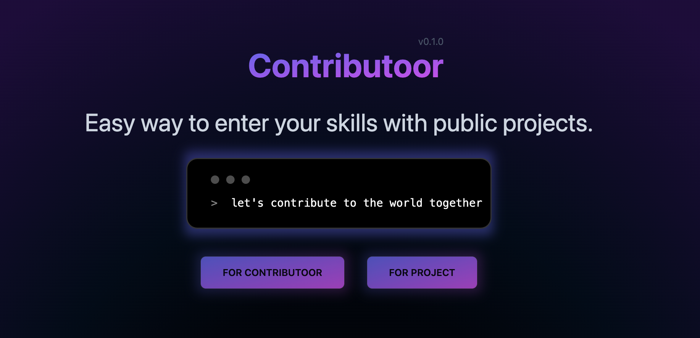
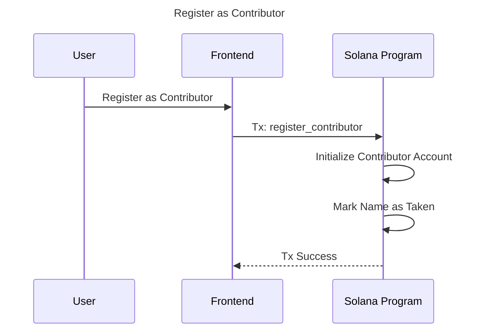
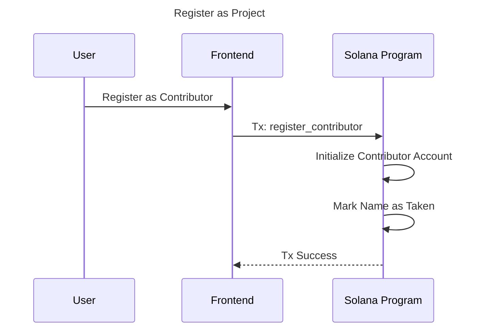
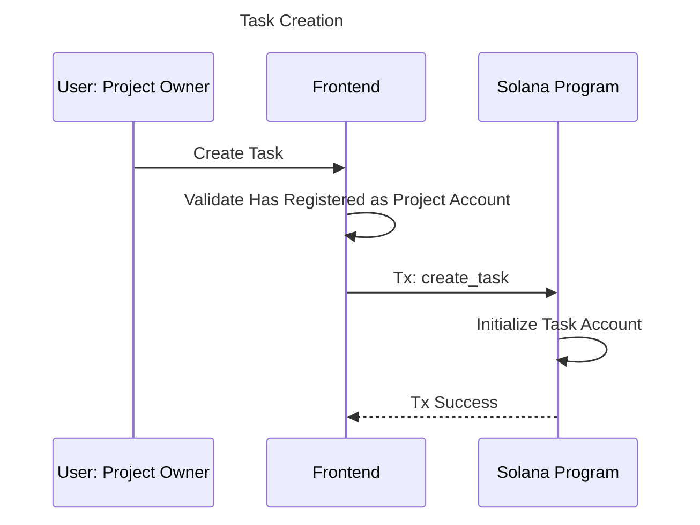
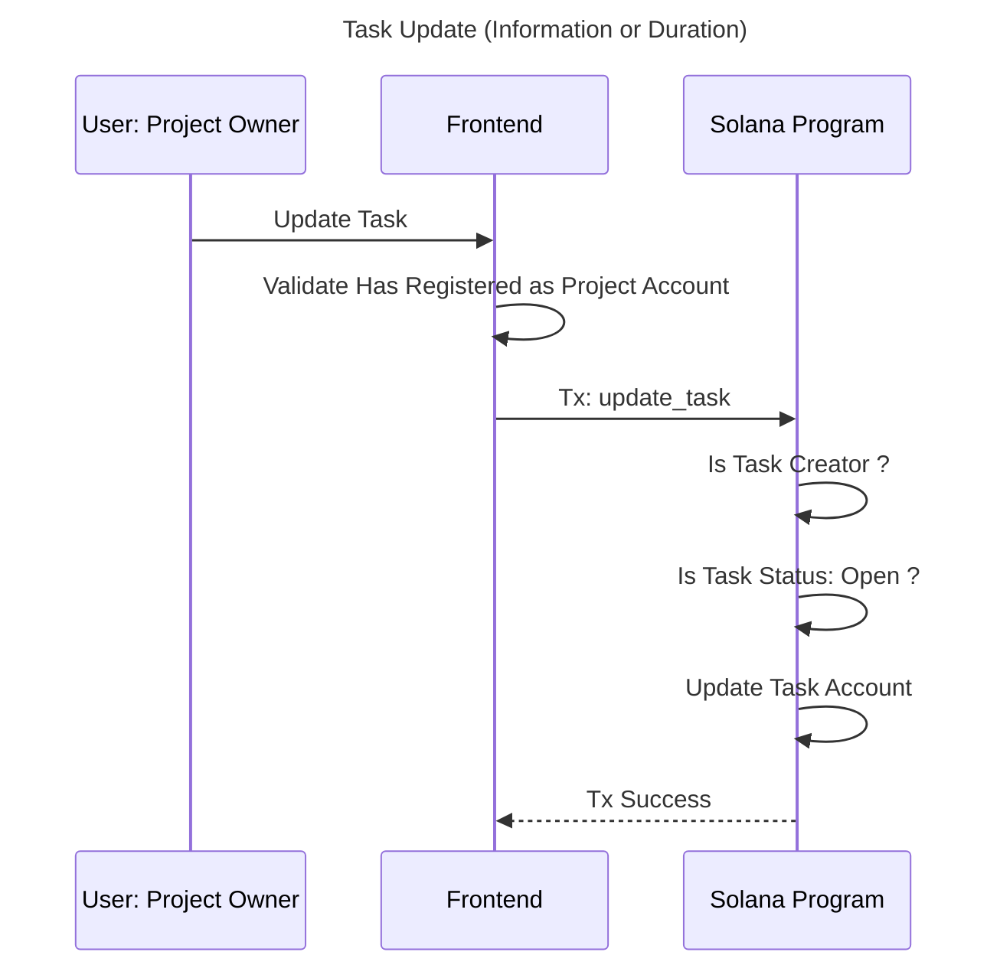
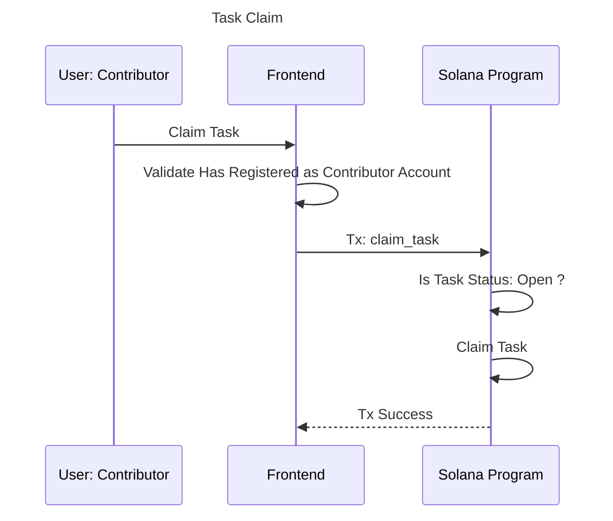
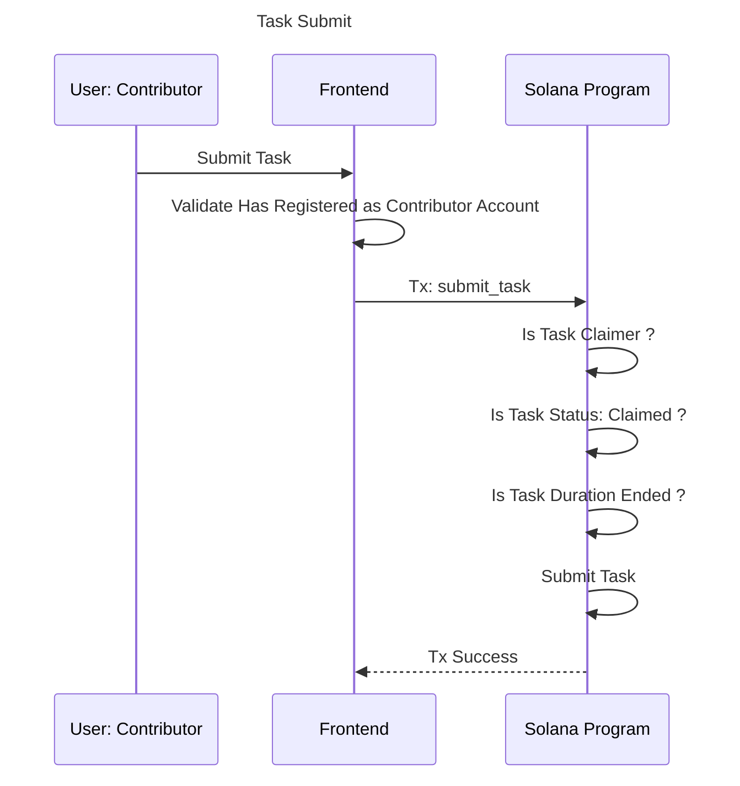
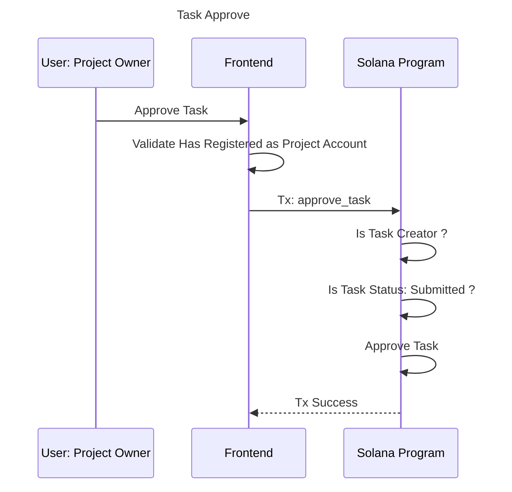
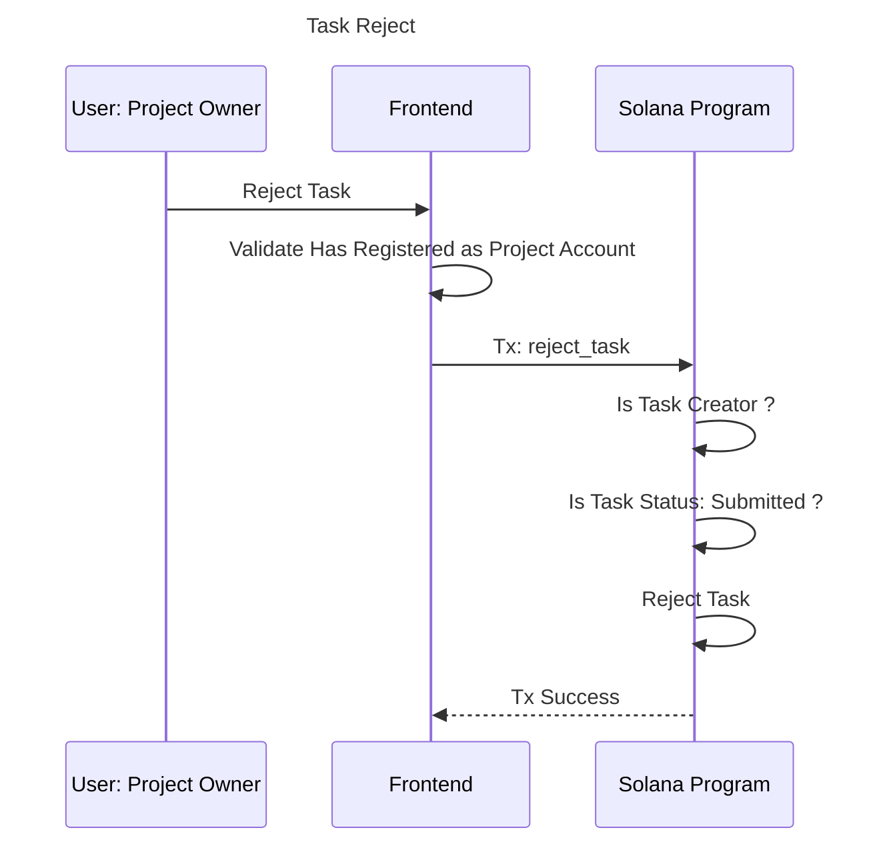

# 🧑🏻‍💻 Contributoor
An MVP platform for managing and rewarding contributors in a decentralized manner using Solana. The platform connects contributors with tasks, allowing them to claim, work on, and submit tasks while being rewarded for their efforts. It also ensures fair distribution and accountability through blockchain-based records.

## Deployed on
* **Devnet**: [2Gy7qY6QX6cBF6WDXY4vssoskAq29witMf4JcSmh1jQd](https://explorer.solana.com/address/2Gy7qY6QX6cBF6WDXY4vssoskAq29witMf4JcSmh1jQd?cluster=devnet)

* For integration test, make sure your solana wallet has enough SOL to pay for the transaction fees or get some faucet [here](https://faucet.solana.com/).

## Motivation
In today’s world, people face **challenges finding credible projects to contribute to** and ensuring that their work is fairly compensated. The MVP Contributor platform aims to address this by offering a decentralized solution for task management, enabling contributors to participate in projects securely and transparently on the Solana blockchain.

## Instructions
### Building and Testing Anchor Program Locally

1. **Install Dependencies**:
- [Rust installed](https://www.rust-lang.org/tools/install)
    - Make sure to use stable version:
    ```bash
    rustup default stable
    ```
- [Solana installed](https://docs.solana.com/cli/install-solana-cli-tools)
    - Use v1.18.18
    - After you have Solana-CLI installed, you can switch between versions using:
    ```bash
    solana-install init 1.18.18
    ```

- [Anchor installed](https://www.anchor-lang.com/docs/installation)
    - Use v0.30.1
    - After you have Anchor installed, you can switch between versions using:
    ```bash
    avm use 0.30.1
    ```
- [Test dependencies](./tests/package.json)
    ```bash
    npm install
    ```


2. **Build the Program**:
    - Navigate to the `anchor_project` directory:
     ```bash
     cd anchor_project
     ```
    - Build the program:
     ```bash
     anchor build
     ```

3. **Test the Program**:
    - Run tests to ensure everything is working correctly:
    ```bash
    anchor test
    ```

### Running the Frontend App Locally

1. **Install Node.js and npm**:
   - Ensure you have Node.js and npm installed. You can download them from [nodejs.org](https://nodejs.org/).

2. **Install Frontend Dependencies**:
   - Navigate to the frontend directory:
     ```bash
     cd frontend
     ```
   - Install the necessary packages:
     ```bash
     npm install
     ```
   - Build the app:
     ```bash
     npm run build
     ```

3. **Run the Frontend App**:
   - Start the development server:
     ```bash
     npm run start
     ```
   - Open your browser and go to `http://localhost:3000` to view the app.

## How it Work (High-level)
The MVP Contributoor platform is built on the **Solana blockchain**, leveraging smart contracts to manage contributors, projects, and tasks in a decentralized manner. 

Here's a high-level overview of its functionality:
1. **Contributor Registration**: Users can register as contributors on the platform. This involves creating a contributor account that tracks their completed and failed tasks.
2. **Project Registration**: Users can also register projects as an Project owner. Each project is associated with an owner and can have multiple tasks.
3. **Task Management**:
    * **Create Task**: Project owners can create tasks, specifying details such as the task name, description, and duration to complete.
    * **Update Task**: Tasks can be updated to change their name, description, or duration by the project owner of each task.
    * **Claim Task**: Contributors can claim tasks that are open, provided they are not the task creator.
    * **Submit Task**: Once a task is completed, contributors can submit it for review.
    * **Approve/Reject Task**: Project owners can approve or reject submitted tasks. Approved tasks are marked as completed, while rejected tasks are reopened.

## How it Work (Each Feature)
### Registration
#### Contributor Account
> source: [registration.rs::register_contributor()](anchor_project/programs/mvp_contributoor/src/instructions/registration.rs#L4-L16)


#### Project Account
> source: [registration.rs::register_project()](anchor_project/programs/mvp_contributoor/src/instructions/registration.rs#L18-L28)


---
### Task Management
#### Create Task
> source: [tasks.rs::create_task()](anchor_project/programs/mvp_contributoor/src/instructions/tasks.rs#L6-L37)


#### Update Task
> source: [tasks.rs::update_task_info()](anchor_project/programs/mvp_contributoor/src/instructions/tasks.rs#L39-L64) | [tasks.rs::update_task_duration()](anchor_project/programs/mvp_contributoor/src/instructions/tasks.rs#L66-L92)


#### Claim Task
> source: [tasks.rs::claim_task()](anchor_project/programs/mvp_contributoor/src/instructions/tasks.rs#L94-L117)


#### Submit Task
> source: [tasks.rs::submit_task()](anchor_project/programs/mvp_contributoor/src/instructions/tasks.rs#L119-L139)


#### Approve Task
> source: [tasks.rs::approve_task()](anchor_project/programs/mvp_contributoor/src/instructions/tasks.rs#L141-L162)


#### Reject Task
> source: [tasks.rs::reject_task()](anchor_project/programs/mvp_contributoor/src/instructions/tasks.rs#L164-L186)



## What's next? 
* **Off-chain backend integration**: as now the program does not handle the prove of work of each claimer, we need to implement a backend that will handle this.
* **Reputation system**: as now the program does not handle the reputation of each contributor, this will encourage contributors to work harder and improve the quality of their work.
* **Reward distribution**: as now the program does not handle the reward escrow distribution, we need to implement a mechanism to distribute the rewards to the contributors for encouraging them to work as well.
* **Escrow system**: this will allow:
    * The project owner to escrow the reward for each task and release it to the contributor once the task is approved.
    * The contributor to escrow their work for each task and only get back their SOL once the task is approved to reduce the risk of fraud for the project owner.
* **DAO integration**: integrate the platform with a DAO to allow the community to vote on the projects and tasks that to make the platform more decentralized and trust among both sides: project owners and contributors.

## Disclaimer
This is a MVP and there is a lot of room for improvement in both **security, features and UX**, the smart contract is not production ready and should not be used in a production environment.