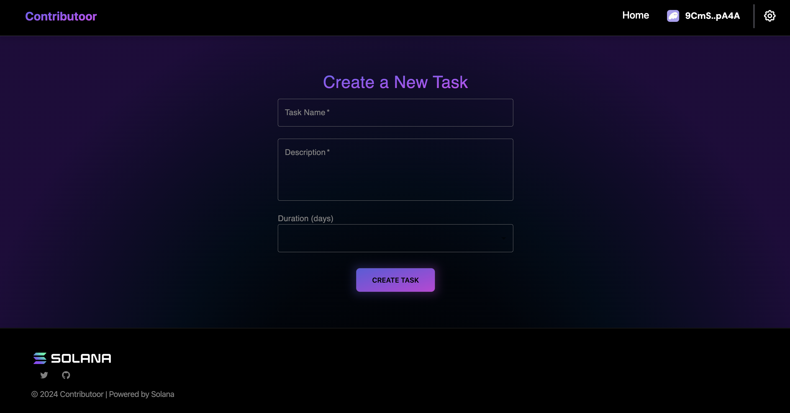

# Contributoor Solana dApp
This is a simple dApp that allows a project to create tasks and a contributor to complete them.

The project is built with React, Typescript, Anchor, and Solana.

## Installation

```bash
npm install
# or
yarn install
```

## Build and Run

Next, run the development server:

```bash
npm run dev
# or
yarn dev
```

Open [http://localhost:3000](http://localhost:3000) with your browser to see the result.

## Endpoints

### Public endpoints
* **Home**: [http://localhost:3000/](http://localhost:3000/)

### Restricted endpoints

#### No account
* **Project Register**: [http://localhost:3000/project-register](http://localhost:3000/project-register)
* **Contributor Register**: [http://localhost:3000/contributor-register](http://localhost:3000/contributor-register)

#### Project account
* **Create Task**: [http://localhost:3000/create-task](http://localhost:3000/create-task)
* **Project Dashboard**: [http://localhost:3000/project-dashboard](http://localhost:3000/project-dashboard)


#### Contributor account
* **Tasks Dashboard**: [http://localhost:3000/tasks-dashboard](http://localhost:3000/tasks-dashboard)

## UI
### Home page


### Wallet Integration


### Project Register page


### Contributor Register page


### Project Dashboard


### Tasks Dashboard


### Tasks Dashboard for Contributor


### Task Create


### Task Update

