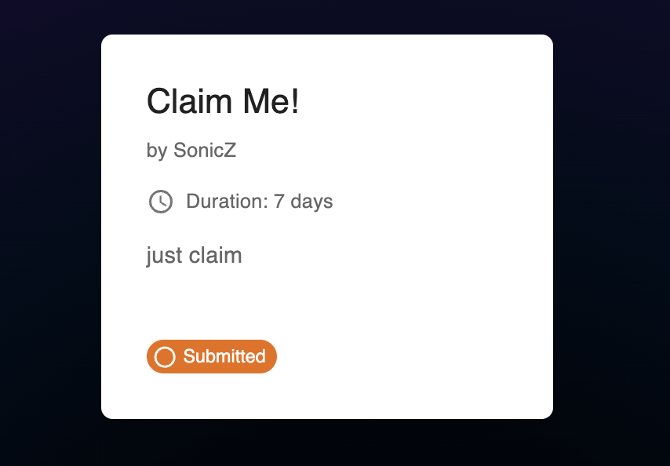

# Contributoor Solana dApp
This is a simple dApp that allows a project to create tasks and a contributor to complete them.

The project is built with React, Typescript, Anchor, and Solana.

## Installation

```bash
npm install
# or
yarn install
```

## Build and Run

Next, run the development server:

```bash
npm run dev
# or
yarn dev
```

Open [http://localhost:3000](http://localhost:3000) with your browser to see the result.

## Endpoints

### Public endpoints
* **Home**: [http://localhost:3000/](http://localhost:3000/)

### Restricted endpoints

#### No account
* **Project Register**: [http://localhost:3000/project-register](http://localhost:3000/project-register)
* **Contributor Register**: [http://localhost:3000/contributor-register](http://localhost:3000/contributor-register)

#### Project account
* **Create Task**: [http://localhost:3000/create-task](http://localhost:3000/create-task)
* **Project Dashboard**: [http://localhost:3000/project-dashboard](http://localhost:3000/project-dashboard)


#### Contributor account
* **Tasks Dashboard**: [http://localhost:3000/tasks-dashboard](http://localhost:3000/tasks-dashboard)

## UI: Main Pages
This section provides an overview of the main pages within the dApp.

### Home page


### Wallet Integration


### Project Register page


### Contributor Register page


### Project Dashboard


### Tasks Dashboard


### Tasks Dashboard for Contributor


### Task Create


### Task Update


## UI: Task Status Experience
This section provides an overview of the task status experience within the dApp as a project owner and a contributor.

#### Project Account
* Task Open 
    - Project dashboard
<br/>
    - Tasks dashboard
        - Other tasks
        <br/>
        - Own tasks: hover on the task card to see disable actions to claim their tasks
        <br/>

* Task Claimed
<br/>

* Task Submitted
<br/>

* Task Completed: When the task is approved by the owner, for rejected tasks, the task will automatically be re-opened.
<br/>

* Task Overdue
<br/>

#### Contributor Account
* Task Open
<br/>
* Task Claimed
<br/>
* Task Submitted
<br/>
* Task Overdue (waiting for owner to reject)
<br/>
* Task Progress Count
<br/>
